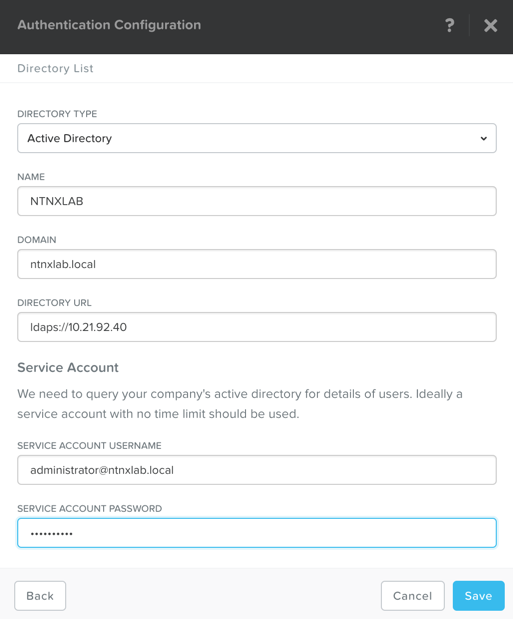
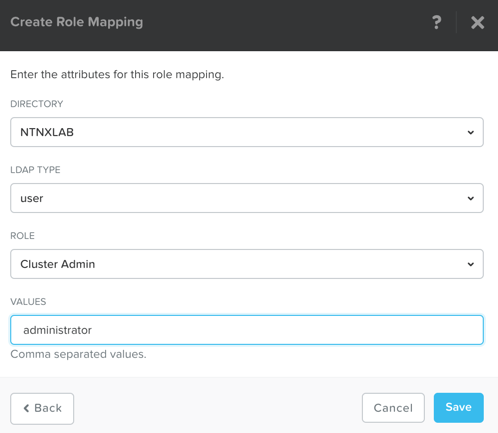

.. _authentication:

-------------------------------
用戶認證和角色映射
-------------------------------

在大多數情況下，使用者都需要將Nutanix集群連接到公司的AD網域或LDAP伺服器中進行許可權驗證.

這將允許用戶直接採用自己的帳號進行存取，而不需要使用Nutanix本地集群的預設管理員帳戶。

.. note::

  以下步驟在PC或PE環境中，操作都完全適用。

在**Prism**, 點擊齒輪**> Authentication**

點擊**+ New Directory**

根據以下提示輸入相關欄位並點擊**Save**:

- **Directory Type** - Active Directory
- **Name** - NTNXLAB
- **Domain** - ntnxlab.local
- **Directory URL** - ldaps://10.21.XX.40
- **Service Account Name** - administrator@ntnxlab.local
- **Service Account Password** - nutanix/4u

點擊**NTNXLAB**旁邊的黃色嘆號

.. figure:: images/authentication_02.png

點擊**Click Here**，進入到使用者映射配置介面

點擊**+ New Mapping**

根據以下提示輸入相關欄位並點擊**Save**:

- **Directory** - NTNXLAB
- **LDAP Type** - user
- **Role** - Cluster Admin
- **Values** - administrator

關閉角色映射和認證視窗，完成配置。
