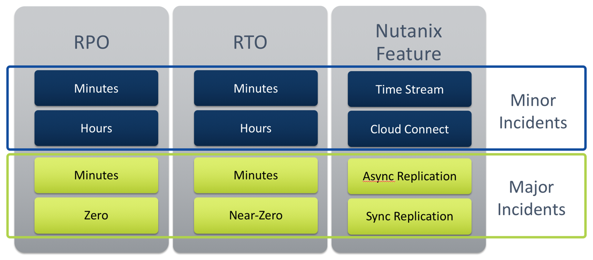
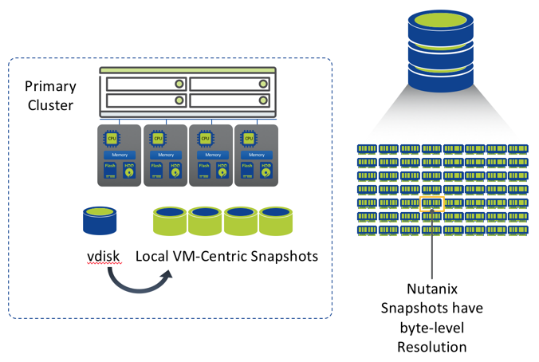
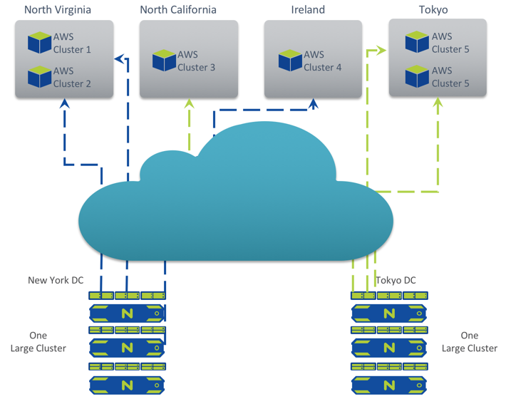
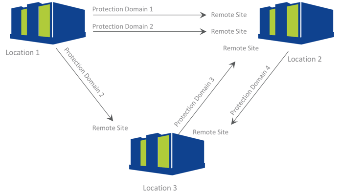
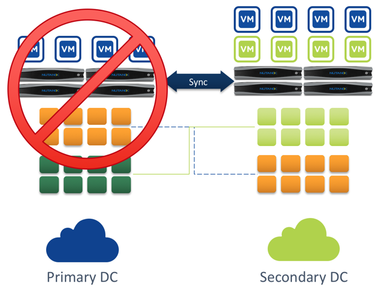
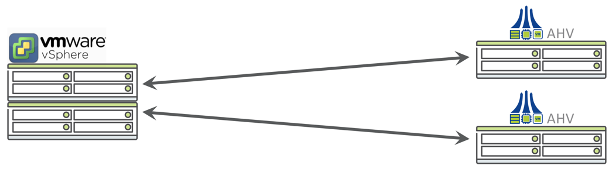
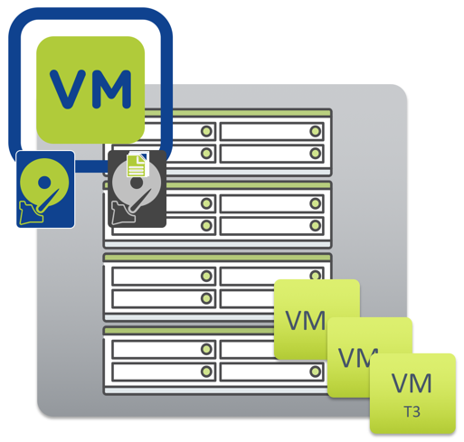

.. _backup_and_dr:

---------------------
介紹-Nutanix備份和災難備援解決方案
---------------------

全面的備份和DR解決方案
++++++++++++++++++++++++++++++++++++

 Nutanix本地快照（時間流）
 .....................................

 應用案例
 
 - 防止客戶作業系統損壞
 - 快照VM環境
 - 自助檔案級別還原

關鍵優勢

 - VM為基本單元
 - 沒有效能影響
-  有效降低儲存節點的每GB成本

Nutanix Cloud Connect
.....................

用途
- 來自Nutanix的混合雲解決方案
- 支援與Azure和AWS整合

應用案例

- 存檔
- 備份

關鍵優勢

 - 易於設置和管理
 - 廣域網路WAN加速傳輸
 - 與Nutanix DR產品天然相容

非同步複製
........................

應用案例

 - 防止VM損壞/刪除
 - 防止完全站點故障

差異優勢

 - 支持多站點DR拓撲
 - 同時支持多個保留策略共存
 - WAN廣域網路優化複製
 - Rest API驅動（客戶DR Runbook）
 - VM和應用程式級別一致性

Metro雙活高可用複寫
.......................................

應用案例

 - 防止完全站點故障
 - 站點發生故障時不會丟失資料

關鍵優勢

- 易於設置和管理
- 支持兩地三中心（第3站點）
- 協力廠商仲裁選項
- Rest API驅動（客戶DR Runbook）

跨管理程式備份和災難備援
..............................

價值主張和效益

- 享受虛擬化管理程式自由選擇的便利，同時使用內建整合備份和災難備援服務
- 享受Nutanix非同步遠端複製技術的所有優點
- 自動遷移配置和VM轉換

自助檔案還原
.........................

用途

 - VM Snapshots中獨立檔案級別復原
 - 無需復原整個VM

差異優勢

- 無需管理員干預的自助服務復原
- 易於設置和管理
- 適用于中型客戶和第2級工作負載的可行備份解決方案

