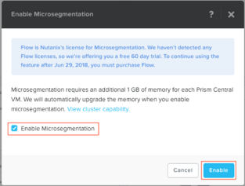

.. _enable_flow:

-------------
高級實作2：FLOW網路虛擬化
-------------
本實作預計完成時間:40分鐘

本實作使用Prism Central,在瀏覽器中打開Prism Central連結，使用admin使用者登錄Prism Central介面

實作目的
++++++++

在本實作中您將啟用Nutanix Flow的功能，也稱為微分段。
首先您需要創建一系列用於Flow實作的虛擬機器，然後我們會將虛擬機器放置在隔離區並進行觀察。您還需要檢查隔離策略中的所有可配置選項，並根據設定的需求，創建不同用途的類別。
然後，我們通過使用新創建的類別的創建隔離安全性原則，以限制未經授權的存取實作。
最後，您將創建一個名為**app-<initials>**的應用程式類別，將**AppType：app-<initials>**類別分配給您的應用程式VM，在本練習中使用**flow-<initials>-5**，並創建安全性原則以限制應用程式VM從**programs-<initials>：sales-<initials>**類別之外的VM接收ICMP ping請求。

啟用網路微分段(Microsegmentation)
++++++++++++++++++++++++++

在瀏覽器中打開PC並登錄， https://<Prism-Central-IP>:9440/.

在巡覽列中，按一下右上角的問號，然後展開功能表中的**New in Prism Central**部分

點擊**Microsegmentation**.

在**Enable Microsegmentation** 對話方塊中選中**Enable Microsegmentation**核取方塊.

.. note::

   每個Prism Central實例只能啟用一次Flow功能。如果您發現在**Microsegmentation**旁邊顯示綠色核取記號，則表示已經有人為本Prism Central實例啟用了Microsegmentation功能。

點擊**啟用**

創建五個虛擬機器
+++++++++++++++

.. note::

  如果您已在實作 - 部署工作負載練習中創建了Flow虛擬機器，請跳過此虛擬機器創建部分

現在，您將創建**五個**虛擬機器，用於測試Nutanix Flow的功能。我們可以直接使用Prism Central中的名為CentOS的範本虛擬機器中創建這些虛擬機器。

在**Prism Central> Explore> VMs**中，按一下**Create VM**。

填寫以下欄位，然後按一下**保存**：

- **Name** - flow-<your_initials>-1
- **Description** - Flow testing VM
- **vCPU(s)** - 2
- **Number of Cores per vCPU** - 1
- **Memory** - 4 GiB
- Select **+ Add New Disk**

  - **Operation** - Clone from Image Service
  - **Image** - CentOS
  - Select **Add**
- Remove **CD-ROM** Disk
- Select **Add New NIC**

  - **VLAN Name** - Primary
  - **IP Address** - *10.21.XX.42*
  - Select **Add**

複製(Clone)其他四個VM:
-------------------------

通過此VM並複製(Clone)四次，完成如下5個VM的創建:

flow-<your_initials>-1
flow-<your_initials>-2
flow-<your_initials>-3
flow-<your_initials>-4
flow-<your_initials>-5

選擇**flow-<your_initials>-1** 然後按一下 **Actions > Clone**.

- **Number of Clones** - 4
- **Prefix Name** - flow-<your_initials>-
- **Starting Index Number** - 2

選擇五個新創建的Flow VM，然後按一下**Actions> Power on**進行開機。

隔離虛擬機器並探索隔離策略
+++++++++++++++++++++++++++++++++++++++++++++++++

確認flow-<your_initials>-1和flow-<your_initials>-2之間的通訊

.......................................................

登錄Prism Central環境並進入**Explore>VMs**介面。

通過核取方塊選中flow-<your_initials>-1和flow-<your_initials>-2，並打開兩個虛擬機器的控制台

點擊**Actions > Launch Console**.

使用以下用戶憑據登錄兩個VM：
- **Username** - root
- **Password** - nutanix/4u

通過命令*ifconfig*查找VM的IP，並從**flow-<initials>-1** VM開始連續ping到**flow-<initials>-2** VM。

隔離VM並編輯隔離策略
..............................................

在**Explore > VMs**菜單中找到flow-<your_initials>-2虛擬機器.

選擇**flow-<your_initials>-2>Actions>Quarantine VMs**。選擇**Forensic**並按一下**Quarantine**。

觀察一下，VM1到VM2的連續ping操作發生了什麼？

導航到**Explore > Security Policies > Quarantine**.

選擇右上角的**Update**，然後選擇**+ Add Source** 隔離策略（Quarantine policy）.

將flow-<your_initials>-1的IP位址增加到**Subnet/IP**欄中，子網路遮罩選擇**/32**。

按一下**Forensic**類別附近的加號（+），並允許任何埠上的任何協議到Forensic隔離類別

思考：
1）該資源可以連接到哪些目標？
2）Forensic和Strict quarantine模式有什麼區別?

選擇**Next > Apply Now**以保存策略.

在添加source來源之後，**flow-<your_initials>-1**和**flow-<your_initials>-2**之間的ping會發生什麼？

在介面**Explore > VMs > **flow-<your_initials>-2 > Actions > Unquarantine VM**取消對**flow-<your_initials>-2的隔離.

使用Flow進行環境隔離

++++++++++++++++++++++++++++++

創建一個新類別
.....................

登錄Prism Central環境並導航至**Explore > Categories**.

.. note::
   可能存在類別或者其它實作人員創建的類別，不要對修改其它的類別，您需要創建一個自訂類別以添加到列表中。

按一下**New Category**.

填寫以下欄位，然後按一下**保存**：

- **Name** - Programs-<intials>.
- **Purpose** - This category will be used to tag VMs belonging to the program called "Programs-<intials>", as an example. This category will have "intern" and "sales" values in order to differentiate intern and sales VMs within the **programs-<intials>** category.
- **Values** - interns-<intials>.
- **Values** - sales-<intials>.

創建新的安全性原則
............................

在Prism Central中導航到 **Explore > Security Policies**.

按一下**Create Security Policy**，選擇**Isolate Environments**.

填寫以下欄位，然後按一下**Apply Now**:

- **Name** - isolate-interns-sales-<intials>
- **Purpose** - Isolate intern vm traffic from sales.
- **Isolate This Category** - programs-<initials>:interns-<intials>.
- **From This Category** - programs-<initials>:sales-<intials>.
不要選中**Apply the isolation only within a subset of the data center**的核取方塊。 

.. note::
  “Save and Monitor”按鈕允許您保存配置並監視安全性原則的工作方式，但不會真正應用，以防止誤操作。

應用新的安全性原則
.............................

在將類別應用於VM之前，確保通訊是正常的
---------------------------------------------------------------------------

導航到**Explore > VMs**.

通過核取方塊選中flow-<your_initials>-1和flow-<your_initials>-2，並打開兩個虛擬機器的控制台

按一下**Actions > Launch Console**.

通過命令*ifconfig*查找VM的IP，並從**flow-<initials>-3** VM開始連續ping到**flow-<initials>-4** VM。

.. note::
  ping應該成功，因為這兩個VM還沒有分配任何類別。
  
為VM flow-3和flow-4分配一個類別：
-------------------------------------------------------
導航到**Explore > VMs**.

選擇**flow-<initials>-3**並按一下**Actions > Manage Categories**.

在UI左側的“設置類別”文字方塊中, 鍵入關鍵字"intern"並從自動完成中選擇**programs-<initials>:interns-<initials>** 點擊Save.

選擇**flow-<initials>-4**並按一下**Actions > Manage Categories**.

在UI左側的“設置類別”文字方塊中, 鍵入關鍵字"sales"並從自動完成中選擇**programs-<initials>:sales-<initials>** 點擊Save.

.. note::
    ping不應該成功，因為這兩個VM現在屬於program-<initials>：intern-<initials>和programs-<initials>：sales-<initials>兩個不同的類別，且屬於之前創建的策略isolate -interns-sales-<initials>，策略會阻止兩個不同類別之間的虛擬機器進行通訊。
    
通過網路微分段確保應用安全
++++++++++++++++++++++++++++++++++++++++++

創建和分配類別
............................

使用新的**app-<initials>**類別來更新**AppType**
------------------------------------------------------

登錄Prism Central環境並導航至**Explore > Categories**.

按一下**AppType**旁邊的核取方塊. 按一下**Actions > Update**.

向下滾動並按一下最後一個條目旁邊的加號

輸入**app-<initials>**,並按一下**Save**.

將VM **flow-<initials>-5**分配給類別**AppType: app-<initials>**.
--------------------------------------------------------------

在Prism Central的**Explore > VMs**視圖中，按一下**flow-<initials>-5** 旁邊的核取方塊.

按一下**Actions > Manage Categories**.

在“設置類別”文字方塊中，鍵入**AppType**並從自動完成中選擇**AppType: app-<initials>**並點擊**Save**保存.

.. figure:: images/set_app_category.png

分配VM**flow-<initials>-1**到預設類別**Environment: Dev**
------------------------------------------------------------------

在Prism Central的**Explore>VMs**視圖中，按一下**flow-<initials>-5** VM旁邊的核取方塊.

按一下**Actions > Manage Categories**.

在“設置類別”文字方塊中，鍵入**Dev**並從自動完成中選擇**Environment: Dev**然後按一下**Save**.

保護應用程式VM
.........................

創建新的安全性原則以保護**app-<initials>**應用程式
--------------------------------------------------------------------

導航到**Explore > Security Policies**.

按一下**Create Security Policy > Secure an Application**.

填寫以下欄位，然後按一下 **Next**:

- **Name** - Protect-app-<initials>, replacing <initials> with your initials.
- **Purpose** - Protect app-<initials> from ICMP outside of sales VMs.
- **Secure this app** - AppType: app-<initials>.
不要選中**Filter the app type by category**選項的核取方塊.

在“Inbound rules”入站規則部分中，使用以下步驟允許傳入流量：

- Leave **Whitelist Only** selected.
- Select **+ Add Source**.
- Leave **Add source by: Category** selected.
- Type **sales** and select **programs-<initials>:sales-<initials>**. Click Add.

完成上述步驟後，按一下**AppType: app-<initials>**左側顯示的+。

這將打開創建“Inbound Rule”的視窗.

在“協定”列中，選擇**ICMP**以允許此應用程式的入站ping請求，並將所有其他欄位留空。點擊**Save**。

在右側，**Outbound**應設置為**Allow All**，對所有**All Destinations**放開存取權限。

按一下**Next**然後按一下**Save and Monitor**.

確認屬於**programs-abc：sales-abc**類別的VM可以ping屬於**AppType：app-abc**類別的應用程式VM。

PC導航到**Explore> VMs**並打開以下三個VM的控制台視窗：

 - The designated AppType: app-<initials> VM, flow-<initials>-5.
 - The Sales VM (a VM in the programs-<initials>:sales-<initials> category, flow-<initials>-4).
 - The Dev VM (a VM in Environment: Dev, flow-<initials>-1).

從Sales VM (4)向AppType: app-<initials> VM (5)發送Ping指令.

此ping請求應該成功

從Dev VM（1）發送ping到AppType：app-abc VM（5）

即使Environment：Dev不是允許的策略的一部分，此ping也會成功。為什麼？

Flow視覺化
++++++++++++++++++

使用Flow視覺化功能為Flow添加策略
..............................................

查看來自Environment：Dev的檢測到的網路流量
-----------------------------------------------------

導航到**Explore > Security Policies > Protect-app-<initials>**，查看在**Environment: Dev**中檢測到的網路流量；

確認**Environment：Dev**被列為**AppType：app-<initials>*的source來源。這可能需要幾分鐘才能顯示。

將滑鼠懸停在黃色流線上，從**Environment：Dev**到**AppType：app-<initials>**，查看協定和連接資訊。

按一下黃色流線，查看更細緻的連接嘗試統計圖。

將檢測到的網路流添加到安全性原則
--------------------------------------------

選擇右上角的**Update**以編輯策略。

按一下**Next**並查看檢測到的網路流量。

將滑鼠懸停在入站清單中的**Environment：Dev**來源上.

選中綠色核取方塊以將此來源添加到入站允許列表

選擇確定以添加到規則

將滑鼠懸停在藍色**Environment: Dev**來源上，然後選擇鉛筆圖示以編輯規則。

點擊** AppType：app-<initials>**上的鉛筆來定義特定的網路埠和協議。

由於在上一個任務中檢測到ping，因此當前已經允許使用ICMP協議。

選擇**Save**以保存ICMP規則。

選擇**Next**以查看對策略的更改。

將策略從**Monitoring**模式移至**Applied**模式
------------------------------------------------------------

既然策略已完成，請將其從監控模式移至應用模式。

選擇**Apply Now**以保存策略並將其移至應用模式

導航到**Explore > Security Policies > Protect-app-<initials>**.

確認**Environment: Dev**以藍色顯示為允許的來源.

請嘗試將來自其他來源，例如將**flow-<initials>-2**發送到**flow-<initials>-5**.

請問此網路流量是否會被阻止？ 

小技巧
+++++++++

- Microsegmentation是一個分散的安全框架，並內置包含在Prism Central內部。
- 它對資料中心提供額外的保護，防範來自在資料中心內部，從一台機器到另一台機器東西向傳播的惡意和安全威脅。
- 在群集中啟用Microsegmentation後，可以通過Prism Central UI中創建的安全性原則輕鬆保護VM。它們可用作標籤，無需任何其他網路設置即可輕鬆應用於VM。
- 在本練習中，您已經使用Flow隔離策略的兩種模式隔離環境中的VM，分別為strict（嚴格）和forensic（取證）模式。
- 取證模式是允許您研究進出VM的連接模式的關鍵欄位，以便在隔離VM時確定允許或拒絕哪些連接。
- 在本練習中，您還可以輕鬆創建類別和隔離安全性原則，而無需更改或更改任何網路配置。
- 使用創建的類別標記VM後，VM只根據其所屬的策略執行操作。
- 您還創建了一個類別來保護特殊應用程式VM。然後，您創建了安全性原則以將ICMP流量限制到該應用程式VM。
- 請注意，創建的策略處於**Save and Monitor**模式，這意味著在應用策略之前，網路流量實際上不會被阻止。這有助於研究連接並確保沒有意外阻止真正的網路流量。
- 網路流視覺化允許您視覺化策略中發生的網路流。從那裡開始編輯策略非常容易，以便添加或刪除應該或不應該發生的網路流。
