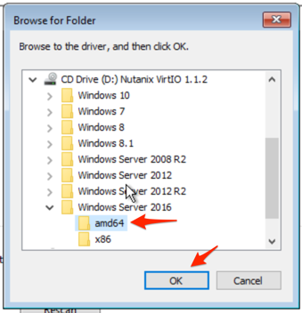

.. _lab_deploy_workloads:

-------------------------
初級實作4-A:AHV的虛機部署
-------------------------
預計完成時間: 15分鐘

本實作使用Prism Central，在瀏覽器中打開Prism Central連結，使用admin使用者登錄Prism Central介面

實作目的
++++++++

瞭解基本的VM部署操作

映像檔配置
+++++++++++++++++++

Nutanix的映像檔服務是用來儲存您的構建ISO以及您創建的虛擬磁碟映射（類似於VMware範本）。

為了方便起見，我們已經預先將本實作使用的CentOS和Windows的映像檔上傳至映像檔服務。

如果需要增加新的映像檔，可在Prism Central的功能表中選擇Explore, 點擊左側巡覽列的Images，然後點擊Add Image, 可選擇URL或上傳image file的方式。

我們本實作使用CentOS ISO上傳作為映像檔並用於部署VM。

在**Prism Central > Explore**, 點擊**Images**.

然後點擊**Add Image**, 選擇**URL**方式.

填寫以下欄位，然後按一下**Upload File**:

- **Enter Image URL** - http://<講師提供IP地址>/images/CentOS-7-x86_64-Minimal-1804.iso
#更新

接下來，按提示填寫以下欄位，然後按一下**Save**:

- **Image Name** - CentOS7-*initials*
- **Image Type** - ISO
- **Image Description** - (Optional) Add a description

現在我們再來上傳Windows 2012 ISO，用於部署實作VM，**如果群集尚未提供此映像檔**

點擊**Add Image**, 然後選擇**URL**選項.

填寫以下欄位，然後按一下**Upload File**:

- **Enter Image URL** - http://<講師提供IP地址>/images/server_2012_r2_vl_x64_dvd_3319595.iso
#更新

接下來，按提示填寫以下欄位，然後按一下**Save**:

- **Image Name** - Windows2012-*initials*
- **Image Type** - ISO
- **Image Description** - (Optional) Add a description

.. note::

  1）在Prism Central中的映射管理，允許您上載的映像檔可同時用於所有在註冊到Prism Central實例的任何群集中。
  2）此工具還可以將VM虛擬磁碟映射轉換為AHV可以理解的格式。
  3）映射服務支援raw，vhd，vhdx，vmdk，vdi，iso和qcow2虛擬磁碟格式

創建Linux VM
+++++++++++++++++++

從Prism Central部署Linux VM

在**Prism Central > Explore > VMs**, 點擊**Create VM**.

按提示填寫以下欄位，然後點擊**Save**:

- **Name** - Linux_VM-*initials*
- **Description** - (Optional) Description for your VM.
- **vCPU(s)** - 1
- **Number of Cores per vCPU** - 1
- **Memory** - 2 GiB

.. figure:: images/deploy_workloads_03.png

- 選擇CDROM旁邊的Edit圖示：
    - **Operation** - Clone from Image Service
    - **Image** - CentOS7-*initials* (The Image we added above)
    - Select **Update**

- 選擇**+ Add New Disk**
    - **Type** - DISK
    - **Operation** - Allocate on Storage Container
    - **Storage Container** - Default Container
    - **Size (GiB)** - 30 GiB
    - Select **Add**

- 選擇**Add New NIC**
    - **VLAN Name** - Primary
    - Select **Add**

點擊**Save**以創建VM.

創建Windows VM
+++++++++++++++++++++

從Prism Central部署Windows VM
.. note::
  
    Nutanix提供了一組與VMware Tools類似的使用者工具和驅動程式。
    要安裝基於Windows的作業系統，必須在安裝時提供Virtual I/O驅動程式，否則虛擬機器無法識別到虛擬虛擬磁碟。 
    Nutanix為AHV上的Windows作業系統提供了一組定制的Virtual I/O驅動程式。
    

在**Prism Central > Explore > VMs**, 點擊**Create VM**.

按提示填寫以下欄位，然後點擊**Save**:

- **Name** - Windows_VM-*initials*
- **Description** - (Optional) Description for your VM.
- **vCPU(s)** - 2
- **Number of Cores per vCPU** - 1
- **Memory** - 4 GiB
- 選擇CDROM旁邊的Edit圖示：
    - **Operation** - Clone from Image Service
    - **Image** - Windows2012-*initials*
    - 點擊**Update**

- 選擇**+ Add New Disk**
    - **Type** - DISK
    - **Operation** - Allocate on Storage Container
    - **Storage Container** - Default Container
    - **Size (GiB)** - 30 GiB
    - Select **Add**

- 選擇**+ Add New Disk**
    - **Type** - CDROM
    - **Operation** - Clone from Image Service
    - **Image** - Nutanix VirtIO
    - Select **Add**

- 選擇**Add New NIC**
    - **VLAN Name** - Primary
      - Select **Add**

點擊**Save**以創建VM.

現在讓我們試試啟動VM:

選擇要啟動的VM，然後從**Actions**下拉式功能表中按一下**Power On**

接下來打開一個控制台會話：

選擇VM，然後從**Actions**下拉式功能表中按一下**Launch Console**。

根據提示進行下一步操作並等待安裝進度到需要選擇Windows安裝路徑的介面，此時系統安裝進程會提示無法找到硬碟

選擇**Load Driver**，並選擇找到Nutanix VirtIO掛載的CD目錄。

瀏覽CD的目錄，並選擇與要安裝的Windows作業系統版本一致的目錄。

.. figure:: images/deploy_workloads_05.png

選擇顯示的三個Nutanix驅動程式 (按住Ctrl鍵並選擇所有三個驅動程式):

- Balloon
- Ethernet adapter
- SCSI passthrough controller

.. figure:: images/deploy_workloads_07.png

點擊下一步.

正常載入驅動程式後，步驟1中創建的虛擬磁碟將顯示為安裝目標。選擇該虛擬磁碟並繼續正常安裝過程。

安裝完成後，可以卸載Windows安裝ISO，並可以從VM中刪除用於驅動程式的其他CD-ROM。

.. note::

  在ESXi中：
  
   - 通過VMware vSphere創建VM後，它將顯示在Prism VMs清單中。
   - 或者，如果通過Prism創建VM，它將顯示在VMware vSphere UI中。
   示例如下圖所示。
   .. figure:: images/deploy_workloads_08.png

小技巧
+++++++++

 - 在本實作中，您可以看到部署Linux VM和Windows VM非常簡單。
 - 映像檔配置工具允許您根據需要可創建一個用於VM部署的可用映射服務目錄，並涵蓋包括qcow，qcow2，vmdk，VHD，VHDx，RAW和ISO的廣泛格式支援。
