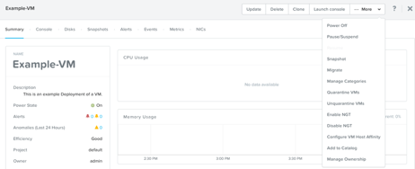
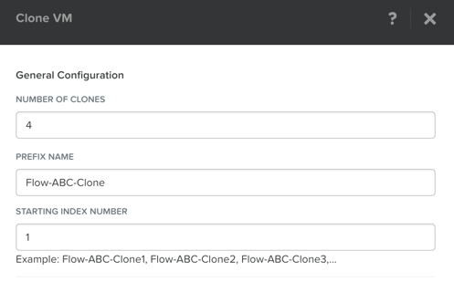
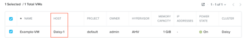
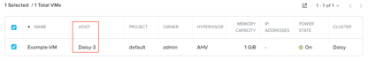
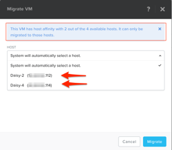

.. _lab_manage_workloads:

------------------------
初級實作4-B:AHV的虛擬機管理 
------------------------

預計完成時間: 15分鐘
本實作使用Prism Central
在瀏覽器中打開Prism Central連結，使用admin使用者登錄Prism Central介面

實作目的
++++++++

學習並掌握通過Prism進行VM管理任務的經驗，包括電源操作，搜索，副本和遷移。

工作負載管理
+++++++++++++++++++

現在您已經成功部署了幾個虛擬機器，讓我們碰探索一些在AHV平臺上如何進行虛擬機器管理的樂趣。

電源操作和控制台訪問
................................

在**Prism Central > Explore > VMs**菜單.

找到您在上一個實作中創建的Linux VM (Linux_VM-*initials*). (必要時可以使用Prism的搜索功能)

.. note::

  請注意，如果該VM的Power State列顯示一個紅點，表示VM已關閉
  
現在我們來啟動VM:

選擇VM，然後從**Actions**下拉式功能表中按一下**Power On**

.. note::

  請同時查看所有可用操作列表（包含 更新，刪除，副本，啟動控制台，開機，暫停/掛起，快照，遷移等）
  
  請注意，此步驟Launch Console功能帶有陰影，表明此操作不可用，因為此時VM正處於關閉狀態。
  
接下來打開一個控制台會話:

選擇VM，然後從**Actions**下拉式功能表中按一下**Launch Console**.

.. note::

  - 控制台視窗打開時，請注意控制台中有三個可用操作(發送CTRL-ALT-DEL，截圖和電源操作).
  - 一旦VM啟動，“Actions”功能表中的“powered on”將更改為“Power Off”。
  - 您還可以按一下VM的名稱以打開特定VM的控制台視窗。
  - 此控制台視窗包含“操作”功能表下可用的所有選項，與效能相關的資訊以及其他相關的VM詳細資訊。

.. note::

 在ESXi環境:

  - 對於ESXi環境，VMware vCenter實例註冊到Prism，本實作的所有步驟同樣有效。 
  - 下圖顯示了在ESXi中託管的VM與AHV中託管的VM之間的“操作”下拉式功能表的橫向比較.

  .. figure:: images/manage_workloads_06.png

Prism搜索功能
............

Prism搜索功能可以更輕鬆地識別問題或在Prism Central中查找相關技術文件資料。
通過鍵入一些搜索條件來使用Prism Central的搜索功能，以體驗如何輕鬆完成上述任務。

一些建議嘗試的搜索條件如下（可以根據需求自訂):

- vm cpu > 1
- vm mem > 2
- vm iops
- create vm
- powered on
- powered on cpu = 8

在**Prism Central >** 點擊放大鏡圖示:fa:`search`.

- 請注意結果類型：實體，警報和説明
- 可通過按一下星形圖示以保存搜索.

.. note::

  搜索功能有快速鍵(斜線符號"/"),在Prism Central的任何介面上都可以通過'/'快速鍵直接調用搜索功能.

VM副本
..........

在**Prism Central > Explore > VMs**.

查找並基於CentOS的虛擬機器副本四個副本

選擇VM，然後從**Actions**下拉式功能表中按一下**Clone**

按如下內容填寫以下欄位，然後按一下**保存**

- **Number of Clones** - 4
- **Prefix Name**  - Flow-*initials*-Clone
- **Starting Index Number** - 1

這些虛擬機器可以保持關閉狀態，他們將在可選高級實作-Flow實作中使用。

在主機之間進行VMotion遷移
..........................

在**Prism Central > Explore > VMs**菜單中.

找到上一個實作中創建的虛擬機器(Linux_VM-*initials*).

- 如果VM已開機，請將其關機

您應該可以看到在關閉電源後,VM的**Host**列中沒有條目。

啟動VM，並記下**Host**列中的**Hosts Name**

選擇VM，然後從**Actions**下拉式功能表中按一下**Migrate**

您可以選擇群集中的其他主機之一作為VM的遷移目標，也可以接受預設值並讓AHV自動選擇位置。

按一下**Migrate**以完成操作.

任務完成後，請驗證您的VM主機位置是否已從上面記錄的主機更改為您選擇的新位置。

配置VM到主機的關聯策略
......................................

在**Prism Central > Explore > VMs**.

找到上一個實作中創建的虛擬機器(Linux_VM-*initials*).

- 如果VM已開機，請將其關機

選擇VM，然後從**Actions**下拉式功能表中按一下**Configure VM Host Affinity**

選擇一個可以與VM關聯的**Host**，如NTNX-AHV-2,然後按一下“Save”完成

啟動VM，並驗證它是否在您在關聯策略中選擇的**Host**上。

選擇VM，然後從**Actions**下拉式功能表中按一下**Migrate**

此時會看到類似如下提示：

-此VM已將主機關聯設置為主機NTNXAHV-2，如果不將主機關聯設置為該主機，則無法將其遷移到任何其他主機
 （This VM has host affinity set to host NTNXAHV-2. It cannot be migrated to any other host without setting the host affinity to that host.）

按一下**Cancel**以退出遷移

選擇VM，然後從**Actions**下拉式功能表中按一下**Configure VM Host Affinity**。

選擇VM可以與之關聯的另一個**Host**，然後按一下“Save”完成。

選擇VM，然後從**Actions**下拉式功能表中按一下**Migrate**。

- 現在有一個顯示可用主機的下拉式功能表

手動選擇主機或允許AHV自動選擇，然後按一下**Migrate**

您應該看到VM已移至另一台主機

高可用性
.................

AHV預設啟用高可用性，並在主機發生故障時以盡力而為的方式重啟VM，我們可以通過額外的配置以預留足夠資源，並確保在故障事件期間始終能夠保證HA有充足資源實現。

VMware HA的工作原理是通過將虛擬機器及其駐留的主機集中到群集中來為虛擬機器提供高可用性，然後監視該群集中的主機，如果發生故障，駐留在故障主機上的VM將在備用主機上重新開機，VmwareHA功能必須在vSphere中手動開啟，AHV預設情況下HA處於打開狀態且無需進行資源保留即可生效。

小技巧
+++++++++

 - 在本實作中，您應該體驗了在AHV上如何提供一套完整的工具和操作流程，以便管理群集中的VM
 - 可以將ESXI集群註冊到Prism，並且可以直接從Prism執行一些基本的VM管理任務
