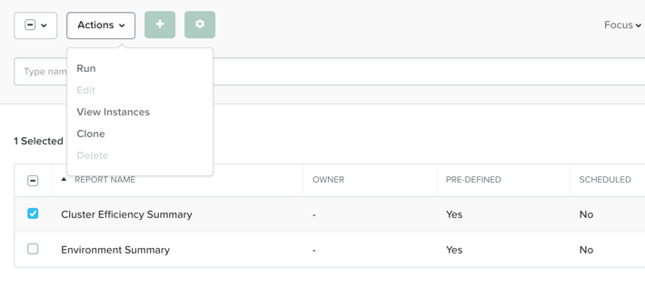

.. _lab_monitoring_env:

----------------
中級實作6:監控與管理 
----------------
預計完成時間: 20分鐘

本實作使用Prism Central,在瀏覽器中打開Prism Central連結，使用admin使用者登錄Prism Central介面

實作目的
++++++++

瞭解Prism Central的監控和資源規劃功能，這些功能可幫助您掌握集群利用率並更準確地預測集群擴展。

Prism Central報告功能
+++++++++++++++++++++

Prism Central允許您生成有關群集環境的歷史報告。
此類報告可包括資源消耗，異常行為和其他有價值的技術建議。

在**Prism Central > Explore > Reports**.

我們先嘗試運行**Cluster Efficiency Summary**報告.

選擇**Cluster Efficiency Summary**,然後從**Actions**下拉式功能表中按一下**Run**.

然後，按提示輸入以下欄位，並點擊**Run**按鈕:

- **Report instance Name** - Cluster Efficiency Summary - *initials*
- **Time Period for Report** - Last 24 Hours

我們再運行一下**Environment Summary**報告。

選擇**Environment Summary**,然後從**Actions**下拉式功能表中按一下**Run**.

接下來，填寫以下欄位，然後按一下**運行**:

- **Report instance Name** - Environment Summary - *initials*
- **Time Period for Report** - Last 24 Hours

報告完成後，選擇要查看的報告項目，然後執行以下操作：

點擊**Actions**下拉式功能表中的**View Instances**。

- 要在單獨的選項卡中查看報告，請按一下報告的名稱.
- 要下載報告，請選中其核取方塊，然後按一下螢幕右上角的**Download**.

查看您在本練習中創建的報告的內容。

Capacity規劃
...............

使用Prism Central的Capacity Runway功能來瞭解群集資源規劃和建議。

在**Prism Central > Planning > Capacity Runway**菜單.

- 注意規劃總結摘要中顯示的是每個群集資源用盡所需的剩餘天數.
- 查查看我們實作環境的集群，到記憶體，CPU和儲存空間資源耗盡還剩下多長時間？

按一下其中一個群集
.. note::

  資源最緊張的專案會在左側突出顯示
  
.. note::

  按一下“儲存”，“CPU”或“記憶體”資源利用率趨勢將分別顯示該資源的圖表

按一下**Optimize Resources**以查看用於資源重新分配的建議管理任務清單，例如優化過度配置的VM，刪除非活動VM或向受限制的VM添加資源。

關閉Capacity Runway視圖.

假設預估規劃
................

基於根據現有容量規劃任務的初始預測，再添加一些假設的新型工作負載規劃，查看預測報告會如何變化。

在**Prism Central> Planning> Scenarios**中，然後按一下**New Scenario**。

接下來，按提示填寫以下欄位：
- **Cluster** - Select a Cluster Model
- **Target** - 6 months
- **Vendor Type** - Nutanix

現在，我們可以添加150個座席的Citrix XenDesktop工作負載。

點擊**+ Add Workload**.

接下來，根據提示填寫以下欄位，然後按一下**Add Workload**：
- **Workload** - VDI
- **Vendor** - XenDesktop
- **User Type** - Power Users
- **Provision Type** - Machine Creation Services (MCS)
- **Number of Users** - 150
- **On** - One Month from now

重複此過程，繼續添加工作負載，直到資源無法滿足六個月的目標。
點擊**Save**保存此場景.

請注意**Resources**部分，顯示的是現有硬體設定。

按一下**Recommend**以查看建議的NX配置以擴展集群來滿足未來需求。

現在讓我們再嘗試更改目標和工作負載並生成新的建議：

- 三個月內增加150個座位.
- 每三個月發生新的需求變化.

生成PDF報告以查看詳細的容量規劃資訊

開放實作: 創建自訂報告
...................................

要從頭開始創建新的自訂報告，請按一下**Actions**旁邊的加號，然後從左側的窗格中添加所需的度量標準。

保存自訂報告後，您可以像運行任何其他報告一樣運行它。

如果想要將報告設置為自動運行，請為其添加日程計畫即可。

小技巧
+++++++++

 -  Prism Central報告管理功能使您能夠根據配置的計畫配置和提供包含有關基礎結構資源的資訊的歷史報告。
 -  Planning儀錶板中的Capacity Runway視圖允許您查看已註冊集群的摘要資源用盡預測，並存取有關每個集群的詳細資源消耗預測資訊。
 - “規劃”儀錶板中的“方案”視圖允許您創建“假設”方案，以評估您指定的潛在工作負載的未來資源要求。
 -  您必須擁有Prism Pro軟體授權才能使用資源規劃工具。
