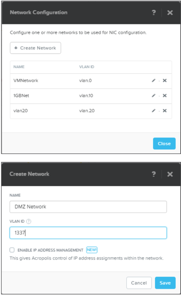
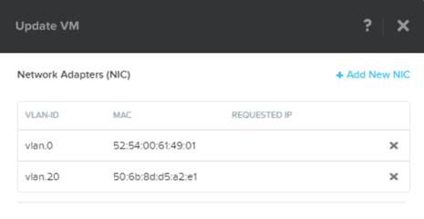
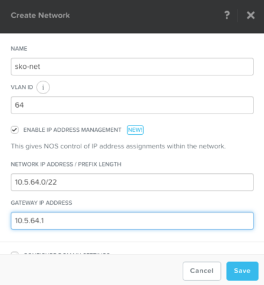
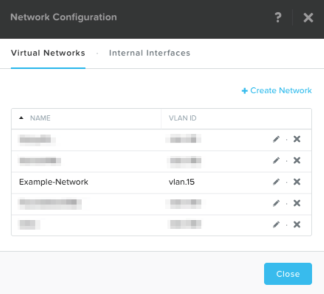

.. _lab_network_configuration:

------------------------------
初級實作3:網路配置
------------------------------
預計完成時間: 10分鐘
本實作使用Prism Central

實作目的
++++++++

瞭解如何使用Prism在集群中設置網路：通過如下步驟可以為VM各自的NIC分配適當的網路，從而為VM提供網路連接能力。

AHV網路背景知識
+++++++++++++++++++++++++

AHV可有效簡化網路拓撲，通常情況下，節點可以連接一個Trunked的VLAN環境，從而允許多個VM網路可以在環境中共存。 

通過AHV, 您還可以通過DHCP伺服器，通過IPAM服務，自動為VM分配IP位址.

虛擬網路
................

- 類似於“分散式埠組“
- 每個虛擬NIC只屬於一個虛擬網路
- 每個虛擬網路是一組虛擬NIC的集合
- 實體交換機埠必須配置為中繼VLAN

虛擬網卡
............

- 每個vNIC只屬於一個虛擬網路
- 對於支援IPAM的網路，vNIC可獲得永久的靜態IP分配
- 使用者可以將網路池配置為自動分配IP，或手動指定IP

IP地址管理（IPAM）
............................

- 內建整合式DHCP伺服器
- AHV會攔截來自IPAM網路上的訪客的DHCP請求，並直接回復回應
- 由虛擬化管理員設定並管理一系列IP位址
- 支援任意DHCP選項，並為DNS和TFTP提供UI介面支援

配置網路
+++++++++++++++++

在本練習中，我們故意使用無效的VLAN，因此無法與現有網路上的VM進行直接通訊。

.. note::

  此練習僅用於展示目的，我們會讓VM連接到vlan 0以外的網路，VM通過DHCP獲取IP，但由於網路無效，不會傳輸任何網路流量。

設置使用者VM網路
.....................

連接到Prism Central並為使用者VM的網路介面創建網路，使用0以外的任何VLAN，不要啟用IP位址管理。

在**Prism Central > Explore**介面, 點擊**VMs**,並點擊**Network Config**

然後點擊**VM Networks**, 選擇**+ Create Network**.

以下欄位根據提示填寫並點擊**Save**:

- **Name** - Network-*intials*
- **VLAN ID** - Something other than 0
- **Enable IP Address Management** - unchecked

填寫完成後的結果會如下圖所示.

使用IPAM設置使用者VM網路
...............................

創建另一個網路，但這次啟用IPAM。

以下欄位根據提示填寫並點擊 **Save**:

- **Name** - Network_IPAM-*intials*
- **VLAN ID** - Something other than 0
- **Enable IP Address Management** - Checked
- **Network IP Address / Prefix Length** - 10.0.0.0/24
- **Gateway** - 10.0.0.1
- **Configure Domain Settings** - unchecked
- **Create Pool** - 10.0.0.100-10.0.0.150
- **Override DHCP Server** - unchecked

.. note::

   可以支援為網路同時創建多個位址池範圍
   
小技巧
+++++++++

- 在群集中設置網路並建立VM連接非常容易.
- 在網路中設置IPAM非常簡單，它可以極大地簡化集群內的IP管理.
