.. _lab_nutanix_technology_overview:

---------------------------------
初級實作1:NUTANIX管理介面介紹
---------------------------------
預計完成時間: 15分鐘

本實作使用Prism Element和Prism Central

簡介
++++++++

本實作將介紹Nutanix兩大管理介面，Prism Element＆Prism Central，並讓您熟悉它們的介面佈局和功能導航。
- Prism Element簡稱PE，是集成在每個CVM管理虛擬機器中，用於單個Nutanix日常管理和操作的介面，
- Prism Central簡稱PC，是額外部署的一套管理虛擬機器，支援分散式集群部署，可以同時管理多個虛擬機器功能，並提供諸如報告，預測，搜索等高級功能，Nutanix集  成的很多高級功能諸如Flow，Calm也都需要在Prism Central中使用

Prism Central
+++++++++++++

在瀏覽器中打開 https://<*Prism-Central-IP*>:9440
建議使用Google Chrome或Firefox瀏覽器

在介面輸入登錄用戶名和密碼資訊，並點擊**Enter**:

- **Username** - admin
- **Password** - *HPOC Password*

登錄Prism Central後，請嘗試各功能，以便熟悉Prism UI

瀏覽**Home** 頁面的各種顯示資訊:

- Cluster Runway
- Cluster Quick Access
- Impacted Cluster | Alerts
- tasks

瀏覽**Explore** 頁面的所有功能選項:

- VMs
- Images
- Clusters
- Hosts
- Disks
- Storage Containers

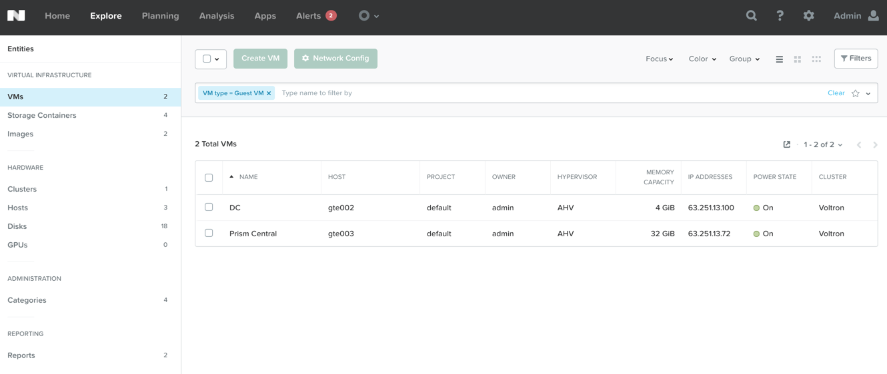

查看其它功能標籤欄，並快速瀏覽:

- Planning
- Analysis
- Apps (We will configure this later in the workshop)
- Alerts
- Tasks :fa:`circle-o`
- Search :fa:`search`
- Help :fa:`question`
- Configuration :fa:`cog`
- User :fa:`user`

.......................
思考時間
.......................

在PC中通過哪個介面能夠顯示所有被管理的主機的清單？ 

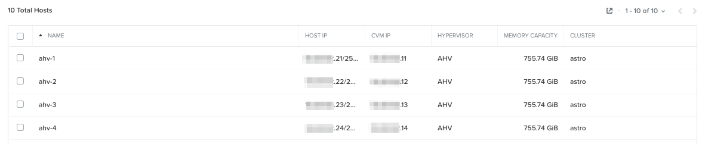

.. note::

如果Prism Central同時管理多個集群，該介面會顯示所有集群中可管理的主機清單。

在**Prism Central > Explore**介面中, 在左邊功能表中點擊**Hosts**.

在哪個介面能夠看到所有已部署的虛擬機器列表？是不是與下圖的介面類似？

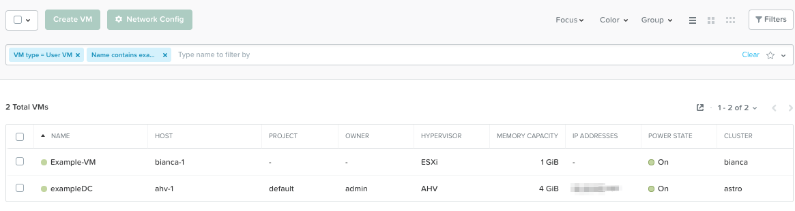

在**Prism Central > Explore**菜單中, 點擊功能表列左邊的**VMs**.

在哪個頁面會顯示系統中的最新活動？
在此頁面上，您可以監控任何任務的進度，並使用時間戳記追蹤過去的操作。
你能想出兩種不同的方法嗎？

第一種方式，在**Prism Central > Home**介面中, 點擊**View All Tasks**. 
第二種方式, 點擊 :fa:`circle-o`

.. note::

  In ESXi:

  - vCenter Server實例可以通過Prism中的:fa:`cog`中進行註冊
  - 將運行ESXi的Nutanix集群註冊到vCenter，可以讓Prism直接運行核心的VM管理操作，而不需要切換至vCenter伺服器。
  - 如果vCenter伺服器也在Nutanix集群中，則可以被自動發現,IP位址可以被自動填充，如下圖所示：

  vCenter註冊到Prism的示例圖：

  .. figure:: images/nutanix_tech_overview_15.png

Prism Element
+++++++++++++

使用Google Chrome或Firefox瀏覽器，使用集群IP登錄到 Nutanix Prism GUI.

Open https://<*NUTANIX-CLUSTER-IP*>:9440

使用以下登錄金鑰進行登錄**Enter**:

- **Username** - admin
- **Password** - *HPOC Password*

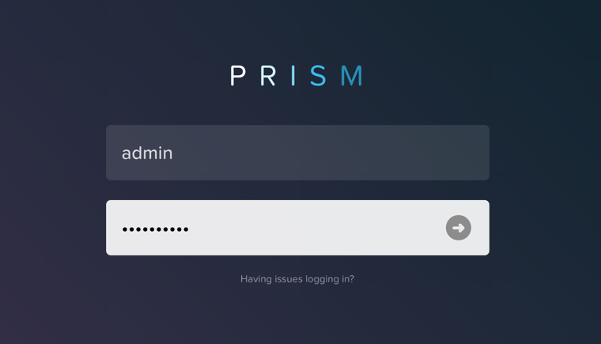

登錄Prism Element後，隨意瀏覽一下，熟悉Prism的管理介面。瀏覽** Home **介面以及其他介面上的資訊。

查看Home介面，並找到以下功能項並記錄：

- Hypervisor
- Version
- Hardware Model
- Health
- VM Summary
- Warning Alerts
- Data Resiliency Status

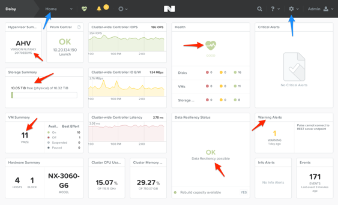

查看快速巡覽列

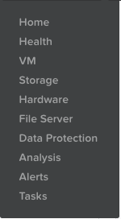

使用巡覽列進入Hardware功能表，查看集群的硬體狀態.

進入**Prism > Hardware**, 點擊**Hardware**, 並點擊**Diagram**.

查看硬體資訊總結:

- Blocks
- Hosts
- Memory
- CPU
- Disks

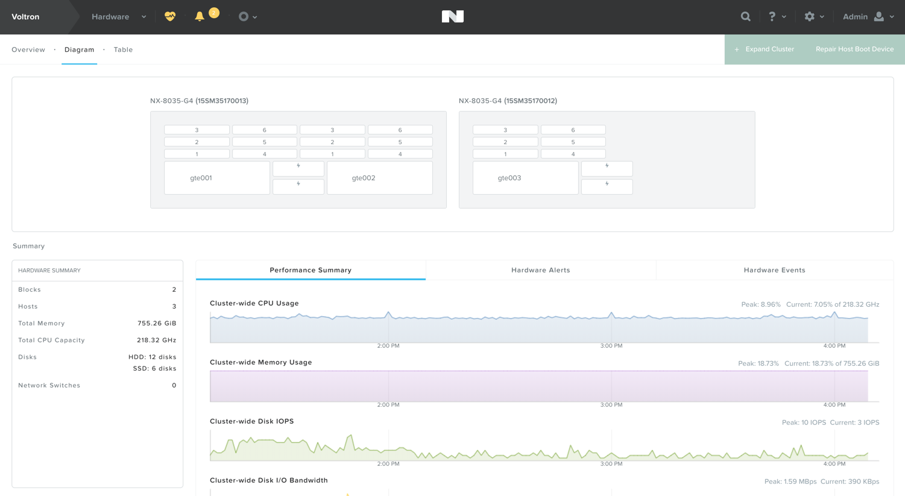

快速瀏覽其它的菜單:

- VM
- Health
- Network
- Data Protection
- Storage
- Alerts
- Etc.

檢查Prism UI的其它部分：

- Health :fa:`heartbeat`
- Alarms :fa:`bell`
- Tasks :fa:`circle-o`
- Search :fa:`search`
- Help :fa:`question`
- Configuration :fa:`cog`
- User :fa:`user`

.......................
思考時間
.......................

1.在哪個介面能找到正在運行的AOX版本？

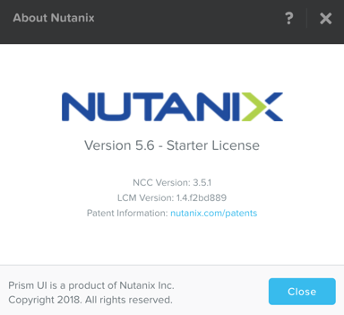

答：您可以在點擊**User**的下拉式功能表中，按一下** About Nutanix **.

2.您如何進入以下介面以查看主機（或節點）數量以及資源容量和當前利用率的摘要？

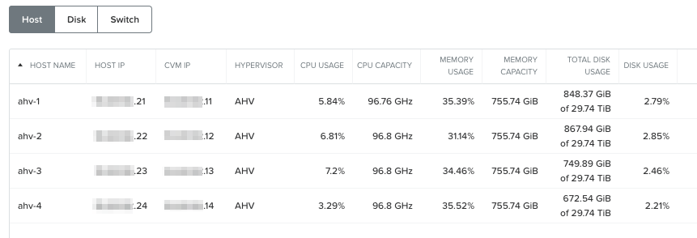

答：在**Prism > Hardware**, 點擊**Hardware**, 然後點擊**Table**.

3. 您可以在哪個介面檢查集群的健康檢查狀態？

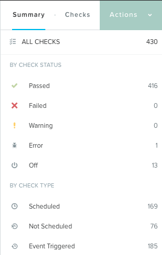

答：在**Prism > Health**, 點擊**Health**, 然後點擊右側的**Summary**功能表.

4. 在哪個頁面能夠顯示系統中的最新活動？
   在哪個頁面上，您可以監控所有任務的進度，並使用時間戳記跟蹤過去的操作。你能想出兩種不同的方法嗎？

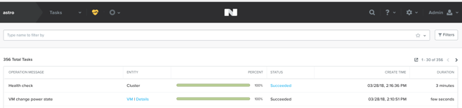

第一種方式，在**Prism > Tasks**, 點擊**Tasks**. 
第二種方式, 點擊 :fa:`circle-o`.

.. note::

  在ESXi中:

  - 在Prism中創建的容器在vCenter中顯示為datastores.

  Prism儲存容器的示例視圖:

  .. figure:: images/nutanix_tech_overview_13.png

  vCenter中儲存容器（Datastore）的範例視圖:

  .. figure:: images/nutanix_tech_overview_14.png

小技巧
+++++++++

- Prism是通過精心設計的UI介面
- 關鍵資訊顯示在前面和中間
- Prism Central可以同時管理多個集群
