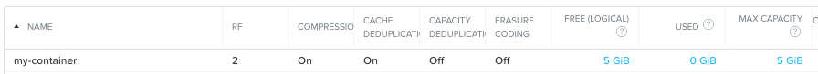
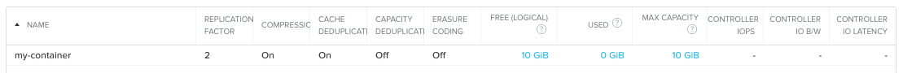
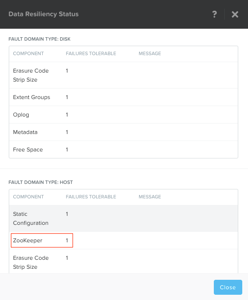

.. _lab_storage_configuration:

---------------------------
初級實作2:儲存容器配置
---------------------------
預計完成時間: 10分鐘

本實作使用Prism Element，在瀏覽器中打開Prism Element連結，登錄Prism Element介面

實作目的
++++++++

在本實作中，我們將使用Prism Element軟體進行基本的儲存容器設置.

Prism Element儲存配置項
+++++++++++++++++++++++++++++++++++++++++

配置儲存容器Container
............................

**Containers** 是軟體定義的邏輯結構，通過設定儲存策略來實現儲存管理的簡化。容器的概念相當於ESXi的datastore

我們先用Prism Element來開始基本的Container創建操作.

在功能表中選擇**Prism > Storage**, 點擊**Storage**標籤欄, 點擊**Table**,然後按一下**+ Storage Container**.

使用以下參數進行本次實作配置 (部分專案需要點擊高級設置**Advance Settings**), 然後點擊 **Save**:

- **Name** - container-*intials*(
- **Advertised Capacity** - 5 GiB
- **Compression** - Enabled (inline 0 mins)
- **Deduplication** - Cache Only
- **Erasure Coding** - Disabled

您可以使用不同的策略創建多個不同用途的容器

.. note::

  容器不會預先保留任何實際的磁碟空間，只是會設置能夠觸發警報的軟限制策略，但不會阻止新的資料寫入到容器。

進一步瞭解容器配置的技巧：

返回上面創建的容器並對其進行編輯，並嘗試增加10Gb的容量。 
此時請查看在上一個任務中創建的容錯因數是多少？ 

容錯因數
.................

我們已經討論了Nutanix集群如何處理資料：讀取，寫入，CVM自動路徑，資料位置，智慧分層和無縫VM遷移。在利用這些特性和功能的同時，Nutanix集群可持續監控和處理資料擺放，以優化性能並允許集群在軟體升級和故障期間保持高可用性。

您可以在Prism中找到容器和集群的容錯級別。

在**Prism> Home**中，按一下Data Resiliency Status框中的**green OK**。這將打開“資料彈性狀態”視窗

上圖顯示了Data Resiliency Status視窗，您可以在其中查看，諸如可以容忍多少ZooKeeper節點故障而不會影響群集。
列出的每個服務都在群集中具有特定功能，Zookeeper節點是用來維護集群的配置資訊。

可以通過按一下齒輪功能表中的**Redundancy State**來配置Prism Element中的RF容錯度。

.. 注::

  在本練習中，請將容錯因數配置為2.

在**Prism >**菜單中:fa:`cog`, 點擊 **Redundancy State**.

小技巧
+++++++++

- 預設群集容錯因數設置為2.容錯因數為2的群集占總可用空間的1/2（30 TB = 15 TB可用空間），因為保留了兩個資料副本。
- ZooKeeper容忍度為1，意味著群集中的一個元件（一個CVM，一個NIC，一個磁碟等）可以關閉而不會影響資料可用性；容忍度為2的故障意味著群集中的兩個元件可以關閉而不會影響資料可用性。這兩個元件可以是不同類型。
