.. _monitoring_and_managing_env:

-----------------------
介紹-系統監控與管理
-----------------------

系統監控和管理
+++++++++++++++++++++++++++++++++++++++

現在我們已經配置了Nutanix集群並且部署和保護了工作負載，我們可以瞭解如何監控和管理我們的Nutanix集群。

一鍵式群集升級
.........................

這功能意味著什麼?

 - 無需人為介入，無中斷地自動升級Nutanix軟體
 - 無需人為介入，無中斷地自動升級虛擬化平台
 - 無需人為介入，無中斷地自動升級韌體和BIOS

關鍵點:

- 節點自動按順序依次重啟
- 無需介入幾分鐘即可完成
- 升級時無需升級時間
- 像升級iOS一樣簡單

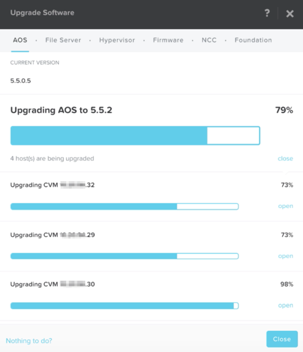

一鍵式虛擬化平台轉換
...............................

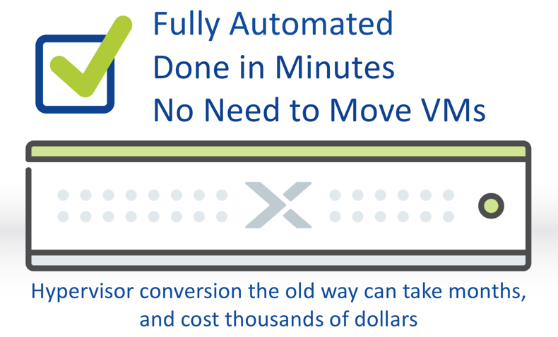

簡單的集群擴展
.........................

只需按一下幾下，即可隨時添加節點來擴展群集。
可以在群集線上運行時無中斷擴展群集

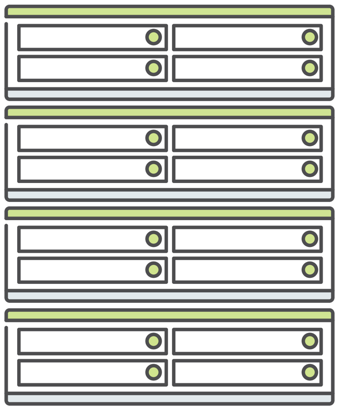

Prism Central中央儀錶板
........................

這是什麼?

- 自訂儀錶板
- 基於小工具
- 全套深入分析資料
- 執行摘要報告

優勢:

- 重要資訊集中顯示

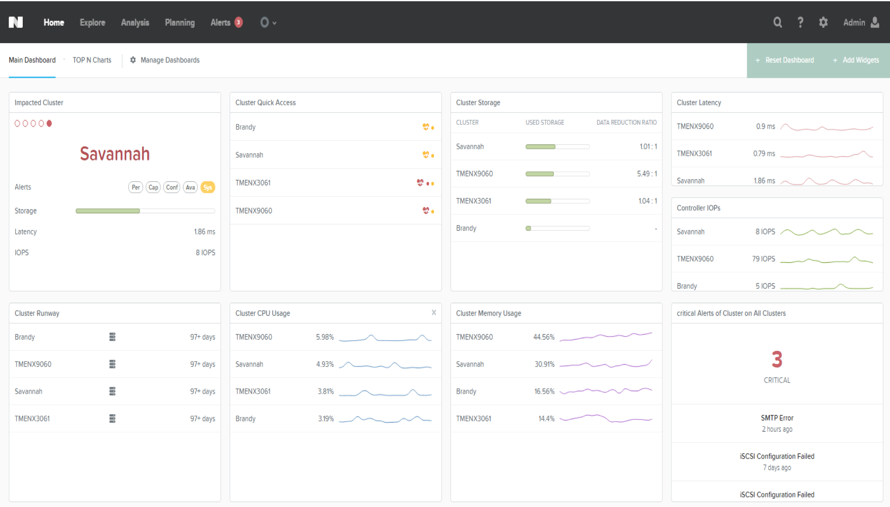

- 網路視覺化
.....................

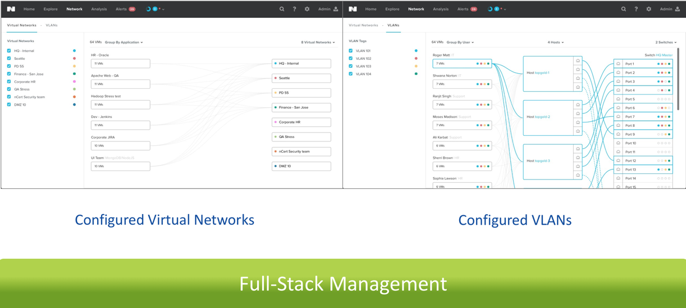

Prism自助服務
..................

用途

- 自助存取 IT資源
- IT管理部門通過策略，直接向最終用戶如開發者提供資源的直接存取權限

組件:

- 管理員入口網站: 創建項目，設置策略，分配用戶
- 最終用戶入口網站: 部署和監控應用程式

優勢:

- 順暢高效服務交付
- 通過類AWS的體驗，實現開發人員賦能

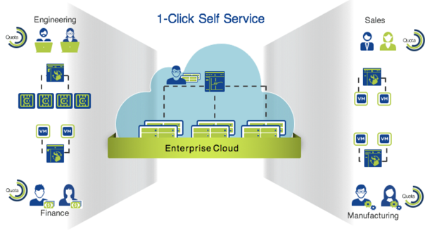

Nutanix Calm
............

Nutanix解決方案堆疊的一部分

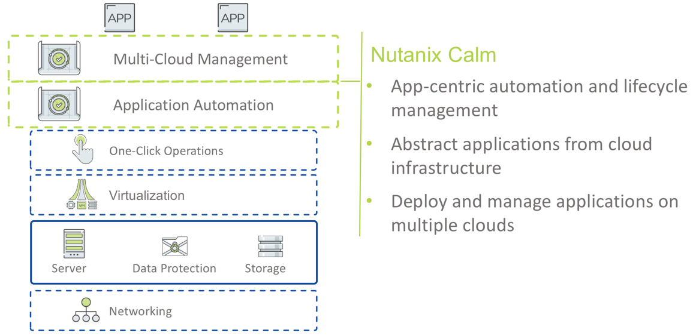

Prism Central報告管理和機器學習能力
.............................................................

通過PC的機器學習功能，您可以:

- 分析資源使用情況.
- 監控資源消耗.
- 識別異常行為.
- 利用結果指導資源規劃.

通過報告管理，您可以:

- 配置並提供包含有關基礎架構資源資訊在內的詳細歷史報告
- 根據您配置的日程，自動將基礎架構的操作洞察報告通過郵件發送

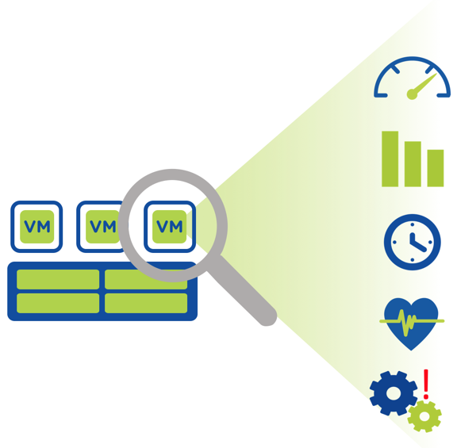

可實施的容量預測
...............................
用途

- 詳細的容量趨勢
- 智慧規劃建議
- 由正在申請專利的X-FIT演算法提供支援

核心優勢:

- 隨容量的擴展按需付費
- 消除憑空猜測

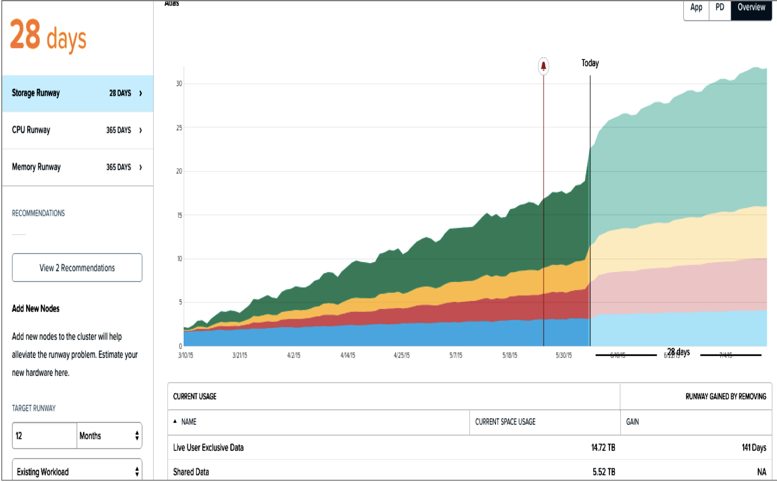

準時預測
.....................

用途

- 基於機器學習演算法，預測容量擴展以滿足未來的工作負載增長
- 根據現有/新的工作負載需求預測擴展規劃
- 由X-FIT提供支援

核心優勢:

- 通過預先定義的工作負載範本和簡單的資訊輸入即可完成規劃，節省時間減少麻煩
- 隨容量的擴展按需付費
- 消除憑空猜測

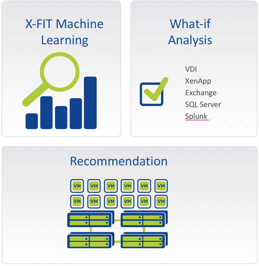

豐富且富有洞察的分析能力
.............................

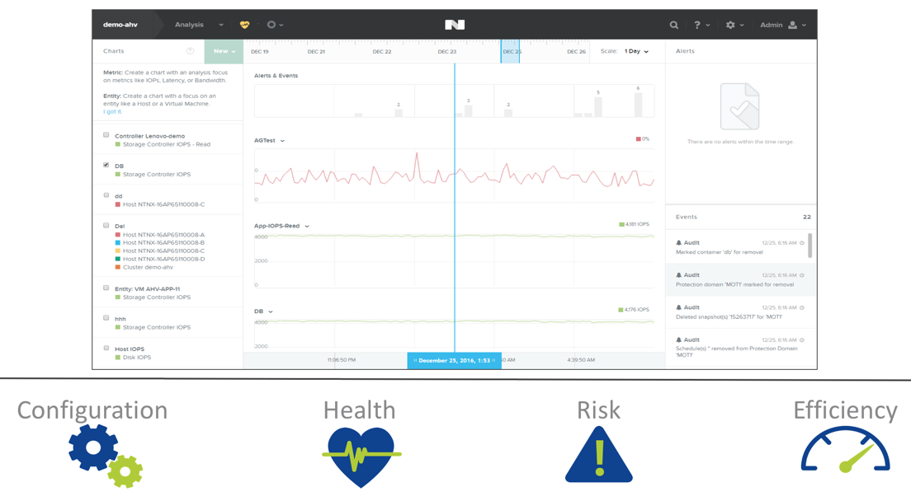

ESXi的VM管理
......................

適用場景

- Prism的ESXi管理
- 不是vCenter的替代

在常見任務中可以直接使用Prism:

- VM Create
- VM Update
- VM Delete
- VM Power On/Off Ops
- Launch console
- Clone

關鍵點:

- 可以跨不同虛擬機器管理程式的消費者級虛擬化管理體驗
- 用於虛擬化，儲存和運算管理的統一管理平面

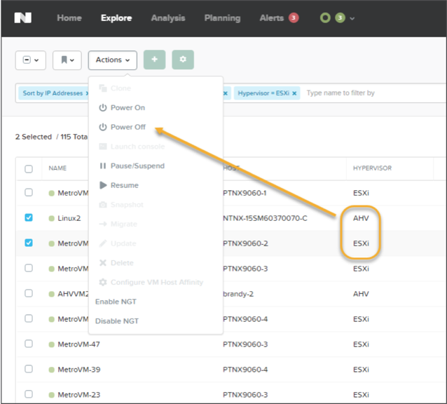

視頻演示：群集軟體更新
#本地視頻源
............................................

該演示展示了對Nutanix群集進行升級是一件多麼容易的事，軟體升級操作不會對應用環境造成影響，且支援隨時執行。

Cluster Upgrade - https://youtu.be/_dzyaWbRkAQ

視頻演示：群集擴展
#本地視頻源
.......................................

This demo shows the ease with which a cluster could be expanded through the addition of one more node into the demo environment.
此展示示範在展示環境中，如何快速添加一個節點並輕鬆對集群進行運算和儲存的擴展。

Cluster Expansion - https://youtu.be/qg0vU48d5XA
