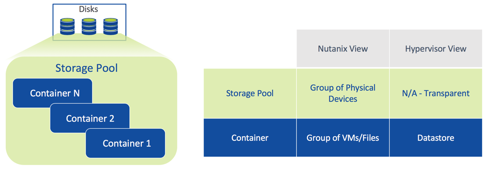
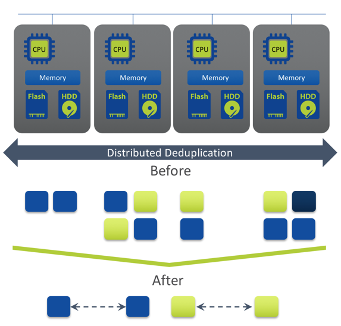
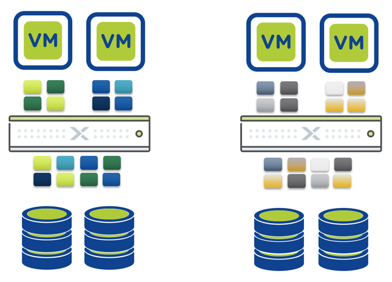
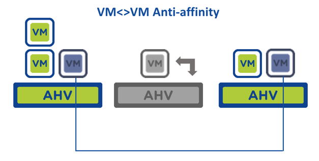
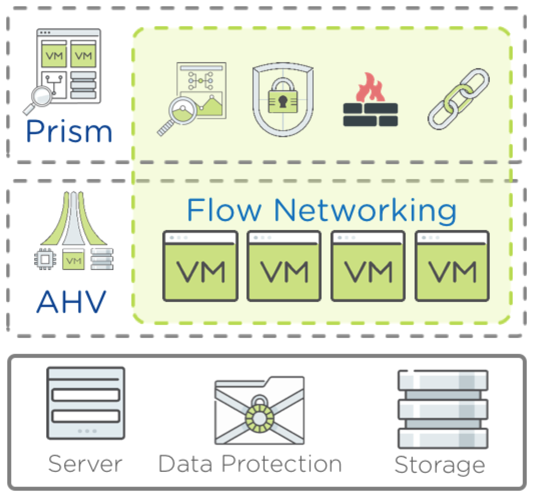
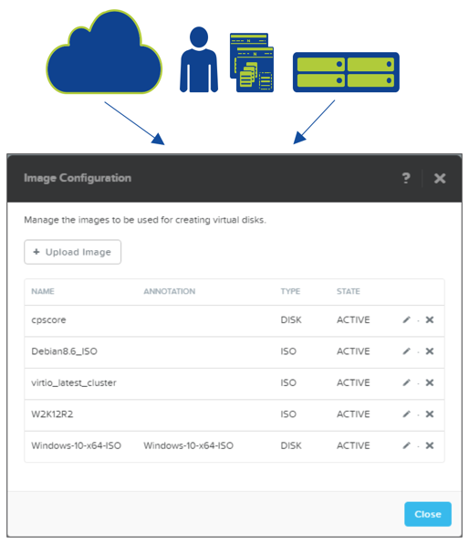

.. _nutanix_terminology:

-------------------
介紹-Nutanix術語
-------------------

Nutanix HCI
+++++++++++

實體基礎設施
.......................

Nutanix集群由節點(Nodes)和區塊(Blocks)組成

儲存池和容器
............................

Nutanix將物理磁片顯示為一個**儲存池**，可以分為一個或多個**容器**

Nutanix儲存
+++++++++++++++

可調整容錯因數
..................

它是什麼？

- 可以靈活地為不同級別的應用程式配置不同級別的容錯度
- 與EC-X糾刪碼配合使用可節省容量

主要區別:

- 純軟體定義，無需掌握儲存相關知識技能；
- RF-3可以容忍兩塊磁碟，雙節點或雙網卡同時故障的場景而不影響業務；
- 可支援RF-2和RF-3線上切換
- 可基於容器級別進行資料集的複製

.. figure:: images/nutanix_terminology_03.png

Nutanix EC-X (Erasure Coding)
.............................

- 資料寫入路徑無需額外資源損耗
- 底層任務
- 只有冷資料集時採用EC-X
- 更低的資料重建時間（等於或由於RF-2）
- 專利演算法（申請中）

重復資料刪除
.............

- 線上指紋識別，近線資料重復資料刪除
- 真正的分散式-完全分佈在所有節點
- 集群內全域重復資料刪除
- SHA-1指紋識別已經使用英特爾處理器指令集處理，以提高效率
- 100%軟體定義
- 強雜湊允許基於中繼資料匹配進行重復資料刪除

壓縮
...........

- 線上和近線壓縮
- 線上: 資料在寫入時壓縮
- MapReduce: 在冷資料移轉至低效能儲存層後進行壓縮
- 對正常IO路徑沒有影響
- 適用於隨機批次處理工作負載
- 採用LZH4c壓縮演算法 (AOS 5+)

資料在地化
.............

- 將資料保存在與VM相同的節點上
- 所有讀取操作都位於同一節點上
- ILM transparently moves remote data to local controller
- Reduces network chattiness significantly
- Data follows VM during vMotion/Live Migration

智慧分層
...................

自動效能優化

 - 利用多層儲存資源
 - 持續監控資料存取模式
 - 最佳地放置資料以獲得最佳性能
 - 無需用戶介入

熱資料 -  SSD

 - 隨機資料
 - 持久層
 - 最高效能
 
冷資料 - 硬碟

 - 循序資料
 - 最大容量
 - 最具經濟效益

CVM自動路徑
................

- 在CVM故障時仍然能夠持續進行資料存取
- 自動更新Hypervisor的路由，以連接其它正在運行的CVM

優勢

- 在軟體升級和故障期間的保持高可用性

.. figure:: images/nutanix_terminology_10.png

vMotion/DRS or Live Migration
.............................

無縫VM遷移

- 中繼資料服務可以從任何地方存取資料
- 資料在地化隨著時間推移持續改善效能

Nutanix VM Mobility
+++++++++++++++++++++++++++++++

Acropolis Dynamic Scheduling (ADS)
..................................

- 自動檢測，修復CPU和儲存熱點
- 自動判斷VM初始的擺放位置
- 檢測異常:
    - CPU熱點
    - 儲存控制器熱點
    - 不符合關連性規則
- 如果發現異常,會通過以下方式重新調節:
    - 虛擬機器的即時遷移
    - ABS iSCSI會話重新導向

主機高可用性
......................

- 主機故障後自動重啟用戶VM
- 直接通過Prism進行政策設定
- AHV選擇最佳的admission control policy:
    - Reserved segments (default)
    - Reserved host

優點

- 永遠線上的虛擬機器
- 減少管理負擔

.. figure:: images/nutanix_terminology_13.png

關聯性規則 - Host
.....................

VM主機關聯性:

- 放置並始終在選定的主機組上保持已啟動的VM

應用案例:

- 軟體授權合乎規範
- 安全/治理
- 硬體分段

“必須”規則 - 不能違反:

- 初始資料擺放
- 高可用
- 主機維護模式
- ADS
- 手動線上遷移

.. figure:: images/nutanix_terminology_14.png

關聯性規則 - VM
...................

VM-VM反關聯:

- 擺放並始終將一組已打開電源的VM保留在不同的主機上

應用案例:

- VM HA故障區域隔離（例如SQL群集)
- 手動規避熱點

“儘量”規則 – 盡最大努力，但可以違反

Nutanix網路
++++++++++++++++++

AHV  - 軟體定義網路
.................................

基於開放標準的完全分散式網路簡化了部署並確保了配置一致性。

- 基於Open vSwitch
 - 完全分發到所有節點
 - 具有vLAN的虛擬網路
 - IP地址管理（DHCP）
 - Bond/Link Aggregation (網路埠綁定/鏈路聚合)
    - Active / Backup
    - Source-NIC Load Balancing
    - LACP
- 每個橋接器都有一個綁定，由一個或多個上行鏈路支持

Flow (網路微分段)
........................

在資料中心內部恢復安全可控和洞察分析的能力

- AHV網路原生功能，無需安裝任何組件
- 通過Prism Central中的類別進行邏輯分組
    - 可根據VM或應用進行分組
- 安全性原則映射到類別
    - 通過對Category成員進行管理簡化流程
- 規則推送路徑：PC -> CVM -> AHV -> OVS
    - AHV中的OVS執行規則
- 邏輯層面，規則在在VM(vNIC)層進行執行
    - 以VM為單位的防火牆

Flow適用場景 – 隔離的環境分區
.................................................

- 通過一鍵式策略進行分區隔離

- 內置針對不同環境類型的預定義類別，使策略編寫變得簡單 - 只需將VM添加到所需類別即可

- 移動工作負載非常簡單，比如只需將類別從Dev交換到Prod即可完成
.. figure:: images/nutanix_terminology_18.png

Nutanix映像檔管理
++++++++++++++++++++++++

映像檔服務
.............

- 託管磁碟映射目錄(RAW & ISO)
- 通過AHV調有現有映像檔
- 通過PE或PC進行映像檔管理
- 線上轉換到Acropolis分散式儲存架構
- 廣泛的格式支持:
    - qcow
    - qcow2
    - vmdk
    - VHD
    - VHDx
    - RAW
    - ISO

